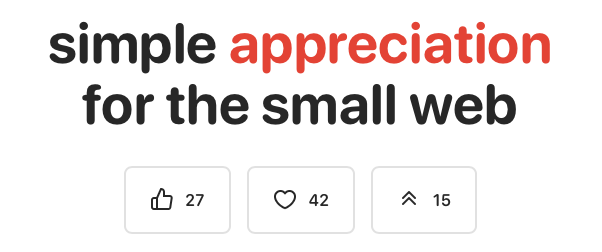

<div align="center">
<p>
    <a href="https://iine.to">
        </a>
    <a href="https://iine.to">
        </a>
    <a href="CONTRIBUTING.md#pull-requests">
        </a>
    <a href="COPYING">
        </a>
    <a href="https://github.com/welpo/git-sumi">
        </a>
</p>

# いいね (iine)

[](https://iine.to)

</div>

appreciation buttons for your blog, digital garden, portfolio… no account required. no user tracking

<div align="center">

### [see the live demo and docs →](https://iine.to)

</div>

## quick start

### 1. add the script

```html
<script src="https://cdn.jsdelivr.net/gh/welpo/iine@main/iine.mini.js"></script>
```

### 2. add the button

```html
<button class="iine-button" aria-hidden="true"></button>
```

that's it! your button will automatically display a heart icon and show the current count

> [!TIP]
> if you use a content security policy (CSP), you'll need to allow scripts from `cdn.jsdelivr.net` and connections to `*.supabase.co`

## features

- no ips, timestamps, or tracking data processed/stored
- pure vanilla javascript, ~3KB minified
- built-in icons (heart, thumbs_up, upvote) + custom emoji
- accessible: semantic html, aria attributes, keyboard navigation
- free (at least until i reach over 100,000 websites; then i may need to ask for donations)
- rate limiting and input validation
- [customisable](https://iine.to#customise)
- [self-hostable](./self-hosting.md)
- [agpl licensed](./COPYING)

## customization

### choose your icon

see the built in svgs @ [iine.to](https://iine.to#customise) or use any emoji:

```html
<!-- default is 'heart' -->
<button class="iine-button" data-icon="heart" aria-hidden="true"></button>
<!-- other options: thumbs_up & upvote -->

<!-- any emoji -->
<button class="iine-button" data-icon="💯" aria-hidden="true"></button>
```

### custom page identifier

to add multiple buttons on the same page:

```html
<!-- use custom slug -->
<button class="iine-button" data-slug="/custom-page" aria-hidden="true"></button>
```

### style with css

buttons without styling can look ugly. iine does not inject any css, so you'll have to add your own

here's a good starting point:

```css
.iine-button {
    display: inline-flex;
    align-items: center;
    gap: 5px;
    margin: 0;
    padding: 0;
    font-size: inherit;
    line-height: inherit;
    cursor: pointer;
    border: none;
    background: transparent;
    color: inherit;

    .icon {
        display: inline-flex;
        align-items: center;
    }

    &:focus {
        outline: 2px solid currentColor;
        outline-offset: 2px;
    }
}
```

available css classes:

- `.iine-button` — main button element
- `.iine-button.clicked` — added after user clicks. use it to style clicked state or to add animations
- `.icon` — icon container (svg or emoji)
- `.counter` — number display

### accessibility

iine buttons are built to be accessible, including keyboard navigation, screen reader support, and focus management.

for screen readers, iine automatically generates `aria-label`s based on the icon and button state. you can set custom labels using the `aria-label` attribute:

```html
<button class="iine-button" aria-label="Love this post"></button>
```

## self-hosting

you can run **iine** on your own Supabase instance/PostgreSQL setup. see the [self-hosting guide](./self-hosting.md)

## how it works

1. client clicks button → javascript sends request to Supabase
2. server validates → checks rate limits, domain, and input
3. counter increments → simple integer increment
4. display updates → new count shows immediately (optimistic update; reverts if server fails)

no user identification, no behavioural tracking, no analytics. just counters that go up

## contributing

something not working? have an idea? let me know!

- questions or ideas → [start a discussion](https://github.com/welpo/iine/discussions)
- found a bug? → [report it here](https://github.com/welpo/iine/issues/new?&labels=bug)
- feature request? → [let me know](https://github.com/welpo/iine/issues/new?&labels=feature)

## license

**iine** is free software: you can redistribute it and/or modify it under the terms of the [GNU Affero General Public License as published by the Free Software Foundation](./COPYING), either version 3 of the license, or (at your option) any later version
